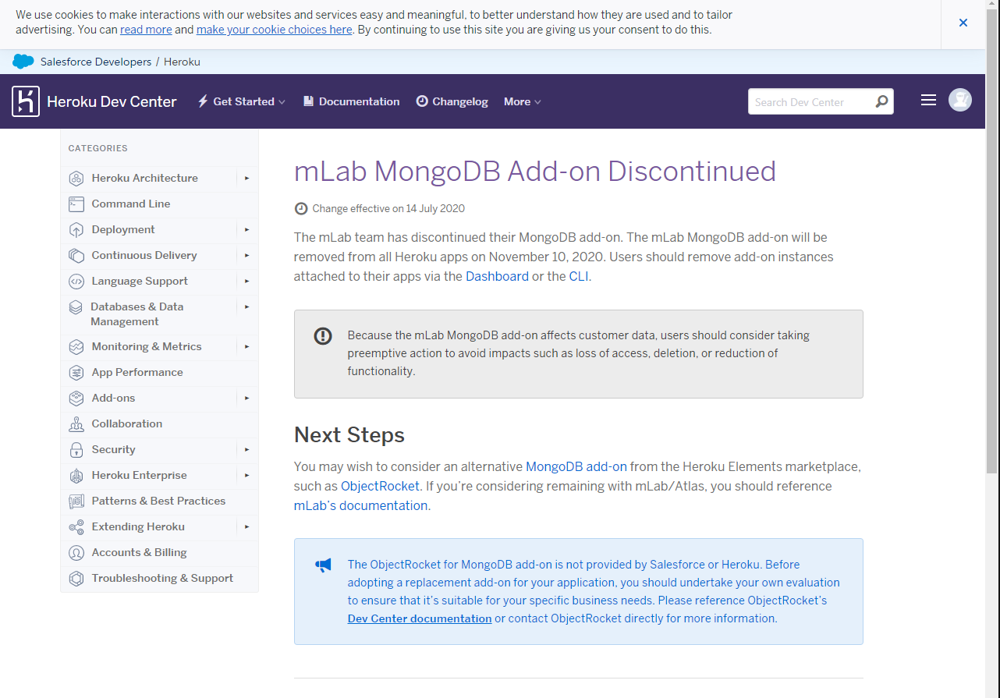
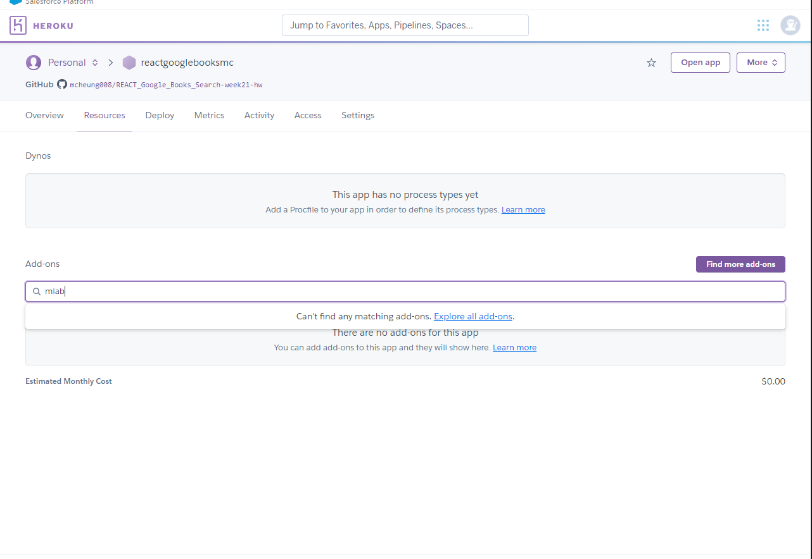
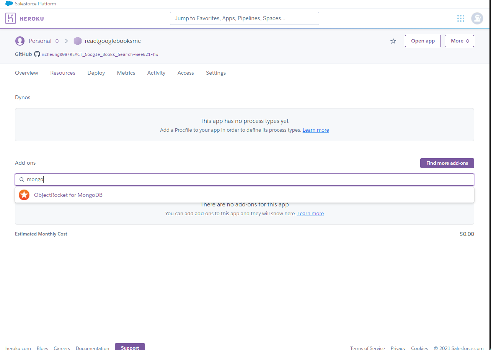
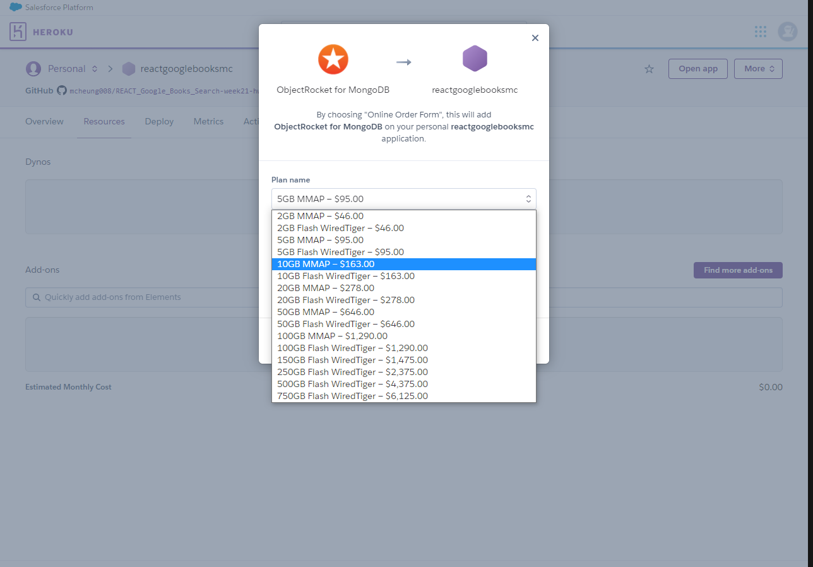

# Google Books Search

---

## Links 

### WORKING APP LOCALHOST

### ERRORS

---

## Description

This app utilizes the MERN stack to allow a user to search for and save books using the Google Books API.

### Table of Contents

- [Technologies](#technologies)
- [Screenshot](#screenshot)

### Technologies

1. MongoDB
2. Express
3. React
4. Node

## Screenshot

